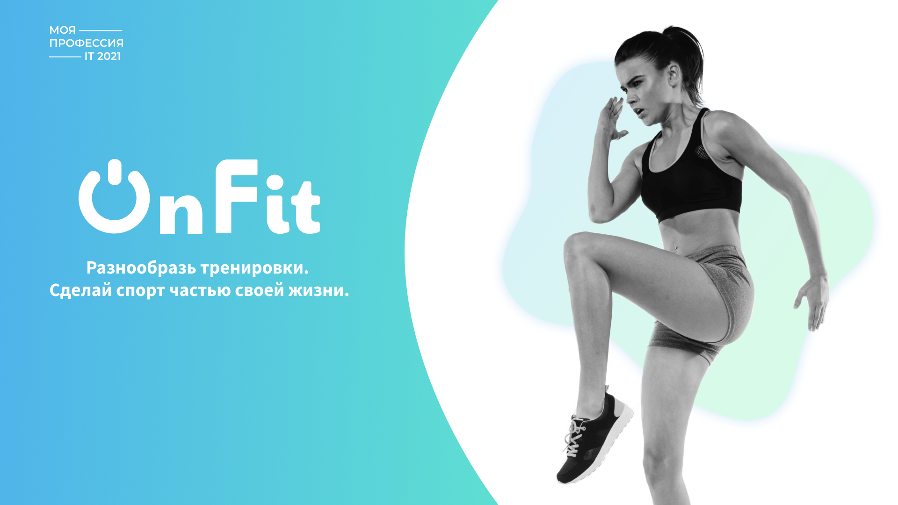
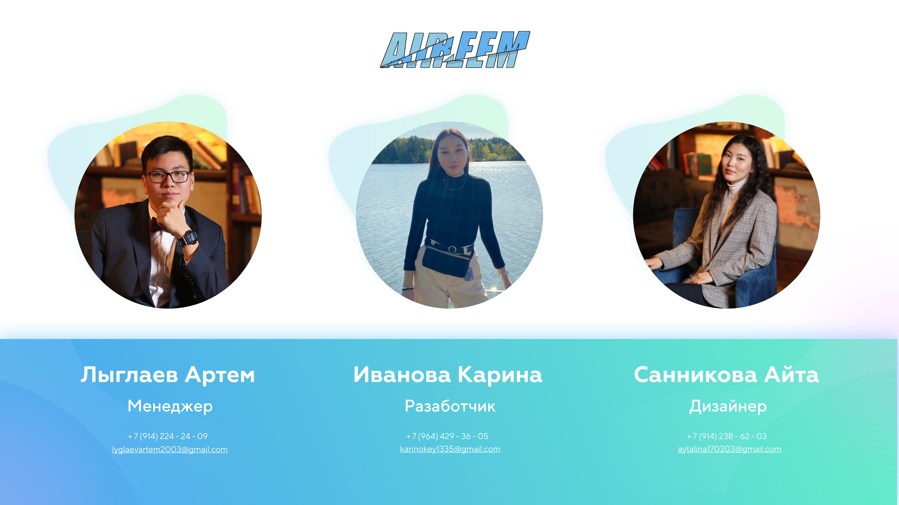

[![Contributors][contributors-shield]][contributors-url]
[![Forks][forks-shield]][forks-url]
[![Stargazers][stars-shield]][stars-url]
[![Issues][issues-shield]][issues-url]
[![MIT License][license-shield]][license-url]
[![LinkedIn][linkedin-shield]][linkedin-url]

<!-- PROJECT LOGO -->
 

  

  <h1 align="center">Здоровье и спорт</h1>

  <h4 align="center">Разнообразь тренировки. Сделай спорт частью своей жизни!
     
    <a href="https://github.com/kdnsks/onfit"><strong>Посмотреть файлы</strong></a>
     
     
    <a href="http://j5557902.myjino.ru//">Посмотреть демо</a>
     
     
  </h4>

<!-- TABLE OF CONTENTS -->

  
Содержимое

  <ol>
    <li>
      <a href="#about-the-project">О проекте</a>
      <ul>
        <li><a href="#built-with">Сделан на:</a></li>
      </ul>
    </li>
    <li>
      <a href="#getting-started">Иллюстрации</a>
    </li>
    <li><a href="#contact">Контакты</a></li>
  </ol>

<!-- ABOUT THE PROJECT -->
<h2 align="center" id="about-the-project">О проекте:</h2>

 
  

<h4 align="center">Выберите тренера для занятий спортом в удовольствие!
Мы поможем найти специалиста под ваши предпочтения, чтобы вы смогли достичь своих целей. 

Оставьте заявку и примите предложение от одного из тренеров.
Используйте приложение и совершенствуйтесь
Мы сотрудничаем со всеми фитнес клубами
вашего города, поэтому вы сможете найти
тренера по любому направлению.

В нашем приложении вы сможете найти
специалистов по фитнесу, ЛФК, йоге, силовым
тренировкам, зумбе, cycle, аэробике, плаванию,
легкой атлетике и многим другим направлениям.</h4>

### Написан на:
Здесь представлены инструменты, которые использовались для создания проекта и самого кода.
* [Bootstrap](https://getbootstrap.com)
* [JQuery](https://jquery.com)
* [HTML](https://html.com)
* [PHP](https://www.php.net/)
* [MySQL](https://jquery.com)
* [JavaScript](https://html.com)
* [Vue.js](https://html.com)
* [Java](https://html.com)

### Иллюстрации:
 

  
  <a href="https://github.com/kdnsks/onfit">
    <video src="Запись экрана (18.04.2021 13-22-12) (convert-video-online.com).mp4" alt="Видео" width="800" height="500">
  </a>
 /p>
    
### Контакты:
 

  

<!-- MARKDOWN LINKS & IMAGES -->
<!-- https://www.markdownguide.org/basic-syntax/#reference-style-links -->
[contributors-shield]: https://img.shields.io/github/contributors/othneildrew/Best-README-Template.svg?style=for-the-badge
[contributors-url]: https://github.com/othneildrew/Best-README-Template/graphs/contributors
[forks-shield]: https://img.shields.io/github/forks/othneildrew/Best-README-Template.svg?style=for-the-badge
[forks-url]: https://github.com/othneildrew/Best-README-Template/network/members
[stars-shield]: https://img.shields.io/github/stars/othneildrew/Best-README-Template.svg?style=for-the-badge
[stars-url]: https://github.com/othneildrew/Best-README-Template/stargazers
[issues-shield]: https://img.shields.io/github/issues/othneildrew/Best-README-Template.svg?style=for-the-badge
[issues-url]: https://github.com/othneildrew/Best-README-Template/issues
[license-shield]: https://img.shields.io/github/license/othneildrew/Best-README-Template.svg?style=for-the-badge
[license-url]: https://github.com/othneildrew/Best-README-Template/blob/master/LICENSE.txt
[linkedin-shield]: https://img.shields.io/badge/-LinkedIn-black.svg?style=for-the-badge&logo=linkedin&colorB=555
[linkedin-url]: https://linkedin.com/in/othneildrew
[product-screenshot]: images/screenshot.png
